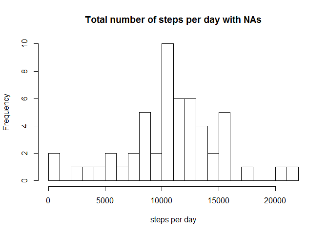
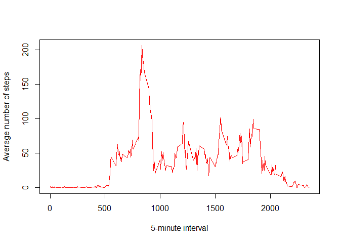
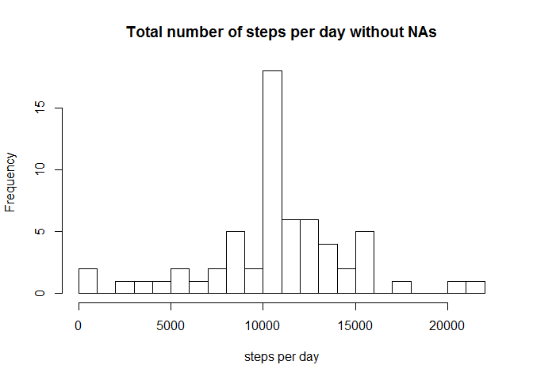
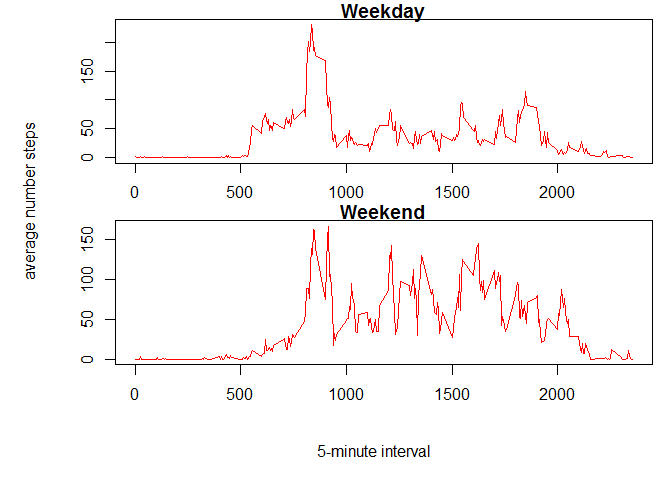

# Reproducible Research: Peer Assessment 1


## Loading and preprocessing the data

To import the data, the workind directory must be set to the
file with the data file. Once this is done, we will import it
to the variable "activity".


```r
activity<-read.csv("activity.csv", na.strings = "NA", colClasses = c("numeric", "Date", "numeric"))
```

For the first parts of the assignment, the NAs will be ignored, we define an "activitynoNA". This will contain the data of "activity" ommitting the rows with NAs


```r
activitynoNA<-activity[complete.cases(activity),]
```

## What is mean total number of steps taken per day?

For the calculation of the total number of steps per day (which we will call "diarysteps") we will use the tapply fuction in the following way:


```r
diarysteps<-with(activitynoNA, tapply(steps, date, sum))
```

Having calculated the total number of steps taken per day we can now plot the histogram.


```r
hist(diarysteps, main="Total number of steps per day with NAs", xlab="steps per day", breaks = 25)
```

<!-- -->

Finally, the mean and median values can be calculated.


```r
meanstepsday<- mean(diarysteps)
medianstepsday<- median(diarysteps)
```

This gives a mean value of 1.0766189\times 10^{4} steps per day, and a median of 1.0765\times 10^{4} steps per day.

## What is the average daily activity pattern?

For this part, we must calculate the average number of steps for the 5-minutes intervals.


```r
stepsinterval<-with(activitynoNA, tapply(steps, interval, mean))
```

With this new variable we can plot the 5-minute interval (x-axis) and the average number of steps taken.


```r
plot(names(stepsinterval),stepsinterval, type="l", col="red", xlab="5-minute interval", ylab="Average number of steps")
```

<!-- -->

Finally, we calculate interval with the maximum number of steps.


```r
maxstepsintervalvalue<-max(stepsinterval)
maxstepsinterval<-names(stepsinterval[stepsinterval==maxstepsintervalvalue])
```

This results in a maximum number of steps for the interval 835.

## Imputing missing values

In this part we have to find a method to avoid the NAs. In this case, we will set the step value of the NA to the ones calculated in the previous section  as average values for each temporal interval. This new data set will be called "activityfilled".

First, the number of NAs will be calculated in the following way:


```r
totalNAs<-sum(is.na(activity))
```

This gives a total number of 2304 NA values.

For filling the activity data set the code will be:


```r
activityfilled<-activity
intervalmean<-cbind(as.numeric(names(stepsinterval)),stepsinterval)
for (i in 1:dim(activityfilled)[1]){
        if (is.na(activityfilled[i,1])){
                activityfilled[i,1]<-intervalmean[intervalmean[,1]==activity[i,3],2]
        }
}
```


Finally, we will plot a histogram of the total number of steps taken each day and calculate the mean and median number of steps.


```r
diarystepsfilled<-with(activityfilled, tapply(steps, date, sum))
hist(diarystepsfilled, main="Total number of steps per day without NAs", xlab="steps per day", breaks=25)
```

<!-- -->

```r
meanstepsdayfilled<- mean(diarystepsfilled)
medianstepsdayfilled<- median(diarystepsfilled)
```

This give a mean of 1.0766189\times 10^{4} steps per day and a media of 1.0766189\times 10^{4} steps per day.

If we compare these new values with the ones obtained in the first part in which we ommitted NAs (mean = 1.0766189\times 10^{4}, median = 1.0765\times 10^{4}), we find a \emph{very} small difference in the case of the median, and a perfect match in the case of the mean value. We do see changes in the y-range of the histogram, but maintaining always the same shape. We can conclude that the effect of filling the gaps with the mean values has a negligible effect.


## Are there differences in activity patterns between weekdays and weekends?

For this final part, we will create a new factor variable with two levels: weekday (Monday to Friday) and weekend (Saturday and Sunday). This new factor will be put in the "activityfilled" data set, calling the new data set "activityfilledweek". The followed steps are:


```r
Sys.setlocale("LC_TIME","English") #to see weekdays in English
```

```
## [1] "English_United States.1252"
```

```r
weekday<- weekdays(activityfilled[,2])
mtwtf<-c("Monday","Tuesday","Wednesday","Thursday","Friday")
activityfilledweek<-activityfilled
activityfilledweek$weekday<-factor(weekday %in% mtwtf, levels = c(TRUE,FALSE), labels = c("weekday","weekend"))
```

Having this new data set with the "weekday" column indicating if it belongs to the weekend or not, we can now calculate the average number of steps for each interval across all weekday or weekend days.


```r
toplot<-with(activityfilledweek, tapply(steps,list( weekday,interval),mean))
par(mfrow=c(2,1))
par(oma = c(4, 4, 0, 0))
par(mar = c(2, 2, 1, 1))
plot1<-plot(intervalmean[,1],toplot[1,], col="red", type="l",main="Weekday",xlab="", ylab="")
plot2<-plot(intervalmean[,1],toplot[2,], col="red", type="l",main="Weekend",xlab="",ylab="")
mtext('5-minute interval', side = 1, outer = TRUE, line = 2)
mtext('average number steps', side = 2, outer = TRUE, line = 2)
```

<!-- -->

We can see how the walking starts later during the weekends, meaning probably that he sleeps longer Saturdays and Sundays. Nice! =)  


